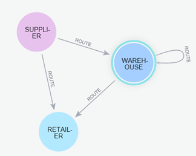

# EP03

O objetivo desta atividade é explorar **consultas e algoritmos de análise de grafos utilizando Neo4j**, aplicando conceitos avançados de Teoria dos Grafos no contexto de **cadeias de suprimento e logística**.

Diferentemente dos exercícios anteriores, neste EP as implementações não serão feitas diretamente em Python. Em vez disso, o objetivo é modelar consultas utilizando **Cypher** e utilizar algoritmos da biblioteca **Neo4j Graph Data Science (GDS)** para analisar a estrutura da rede logística.

---

# Orientações Gerais

* Utilize estritamente a estrutura disponibilizada no repositório. Não altere nomes de arquivos nem sua localização, pois isso poderá inviabilizar a correção automática da atividade;

* Todas as consultas devem ser escritas em **Cypher**, utilizando o banco de dados Neo4j disponibilizado para a disciplina;

* Quando solicitado, utilize algoritmos da biblioteca **Graph Data Science (GDS)**. Não implemente esses algoritmos manualmente;

* Organize as consultas de forma consistente e utilize nomes significativos para variáveis, facilitando sua leitura e manutenção;

* Cada grupo deverá desenvolver sua própria solução. As respostas serão inspecionadas visualmente e mecanicamente. Caso seja detectada cópia entre grupos, poderão ser aplicadas penalidades, incluindo nota zero na(s) questão(ões) envolvida(s);

* É responsabilidade do grupo manter sua solução privada durante todo o período da atividade;

* O trabalho deve ser realizado em grupo. Casos excepcionais deverão ser comunicados previamente à equipe de ensino.

---

# Entrega

* Realize *push* da versão final do repositório até o prazo definido no Google Classroom;

* Caso o projeto contenha erros que impeçam sua execução ou a execução dos testes automáticos, estes não poderão ser corrigidos após o prazo;

* A participação individual será avaliada através do histórico de *commits* e edições do repositório;

* Alterações realizadas após o prazo serão tratadas conforme as regras da disciplina para atividades de reposição.

---

# Domínio do Problema

Neste exercício continuaremos utilizando o mesmo domínio dos EP01 e EP02.

Uma **cadeia de suprimento** é composta por fornecedores, centros de distribuição e clientes, conectados por rotas de transporte que representam o fluxo de mercadorias. O objetivo da empresa é compreender melhor sua rede logística, respondendo perguntas estratégicas por meio de consultas ao banco de dados e algoritmos de análise de grafos.


---

# Modelo de Dados no Neo4j

A rede logística é representada por um grafo direcionado contendo três tipos de vértices.

* `SUPPLIER` - Representa um fornecedor de produtos. Principais propriedades:  `name`, `city`,  `capacity`
* `WAREHOUSE` - Representa um centro de distribuição. Principais propriedades: `name`, `city`, `capacity`
* `RETAILER` - Representa o cliente final. Principais propriedades: `name`, `city`, `retailer_type`

Todos os relacionamentos possuem tipo `:ROUTE` e representam rotas de transporte entre entidades da cadeia logística.
Cada relacionamento possui, entre outras, as propriedades: `capacity`,  `distance`, `cost`, `name`

O modelo admite apenas as seguintes conexões:

```
SUPPLIER  ──ROUTE──► WAREHOUSE

WAREHOUSE ──ROUTE──► WAREHOUSE

WAREHOUSE ──ROUTE──► RETAILER
```

Não existem relacionamentos diretos:

* Supplier → Retailer
* Retailer → qualquer outro vértice

---

# Importação do Grafo

Após criar um sandbox Neo4j vazio, importe o grafo utilizando o procedimento APOC.

```cypher
CALL apoc.import.graphml(
  "https://raw.githubusercontent.com/TG-Rep/2026.1-EP03-Grafos-Spec/refs/heads/main/norte_nordeste_bidirecional_realista.graphml",
  {readLabels: true}
);
```

Após a importação, os vértices possuirão uma propriedade denominada `type`. Essa propriedade deve ser convertida em labels do Neo4j.

```cypher
MATCH (n)
WHERE n.type IS NOT NULL
WITH n, toUpper(n.type) AS label
SET n:$(label)
REMOVE n.type
RETURN count(*) AS updatedNodes;
```
Como funciona?
* `WITH n, toUpper(n.type) AS label` - converte o atributo `type` (`supplier, warehouse, retailer`) para `SUPPLIER`, `WAREHOUSE` e `RETAILER`.
* `SET n:$(label)` - adiciona dinamicamente a label cujo nome está armazenado na variável label.
Essa é a sintaxe recomendada nas versões recentes do Neo4j.
* `REMOVE n.type` - Remove a propriedade `type`, já que ela passa a ser representada pela label.
  
Em seguida, substitua o relacionamento `RELATED` pelo relacionamento `ROUTE`.

```cypher
MATCH (a)-[r:RELATED]->(b)
WITH a, b, r, 'ROUTE' AS relType
CREATE (a)-[newRel:$(relType)]->(b)
SET newRel = properties(r)
DELETE r
RETURN count(*) AS updatedRelationships;
```

---

# Verificação da Importação

Antes de iniciar o exercício, recomenda-se verificar se a importação foi realizada corretamente.

#### Visualize o esquema da base de dados:

```cypher
CALL db.schema.visualization();
```

>  Saída Esperada:



#### Liste os tipos de nodes existentes:

```cypher
CALL db.labels();
```

>  Saída Esperada: 
```
"SUPPLIER"
"WAREHOUSE"
"RETAILER"
```

#### Liste os tipos de relacionamento:

```cypher
CALL db.relationshipTypes();
```

> Saída Esperada: 
```
ROUTE
```

#### Verifique quantos nós e relacionamentos contém:

```cypher
MATCH (n)
WITH count(n) AS nodes
MATCH ()-[r]->()
RETURN
    nodes,
    count(r) AS relationships;
```

> Saída esperada:

nodes | relationships
------| -------------
88    |  165

---

# Objetivos do EP03

Ao final desta atividade, espera-se que o aluno seja capaz de:

* escrever consultas utilizando a linguagem Cypher;
* utilizar agregações e agrupamentos sobre grafos;
* executar algoritmos da biblioteca Graph Data Science;
* interpretar métricas de centralidade;
* identificar comunidades em redes logísticas;
* modelar problemas clássicos de Teoria dos Grafos em Neo4j;
* interpretar resultados obtidos por algoritmos de análise de grafos no contexto de cadeias de suprimento.

---

# Questões

## Questão 01 — Dashboard Estrutural

Uma empresa deseja obter uma visão geral da estrutura de sua rede logística antes de realizar análises mais avançadas.
Utilizando consultas em **Cypher**, construa um pequeno painel (*dashboard*) contendo informações estruturais sobre a rede. As consultas deverão ser implementadas no arquivo: `cypher/Q01.cypher`

#### (a)  Escreva uma consulta para determinar quantos vértices existem de cada um dos seguintes tipos: `SUPPLIER`, `WAREHOUSE`, `RETAILER`.

> Saída Esperada:

type | quantity
------|-----------
"SUPPLIER" | 16
"WAREHOUSE" | 24
"RETAILER" | 48

#### (b)  Escreva uma consulta para identificar os centros de distribuição que atendem diretamente o maior número de clientes (`RETAILER`). A consulta deve retornar: nome do warehouse e quantidade de clientes atendidos. Os resultados devem ser apresentados em ordem decrescente da quantidade de clientes.


> Saída Esperada  (24 records):

warehouse | retailers
----------| ------------
"Warehouse NE_W3" | 4
"Warehouse NE_W5" | 4
"Warehouse NE_W12" | 4
... | ...


#### (c) Escreva uma consulta que identifique os fornecedores que abastecem diretamente o maior número de centros de distribuição. A consulta deve retornar: nome do fornecedor e quantidade de warehouses abastecidos. Os resultados devem ser apresentados em ordem decrescente.

> Saída Esperada (16 records):

supplier | warehouses
---------|------------
"Supplier NE_S1" | 3
"Supplier NE_S2" | 3
"Supplier NE_S3" | 3
... | ...


#### (d) Escreva uma consulta para determinar quais cidades concentram o maior número de centros de distribuição. A consulta deve retornar: cidade e quantidade de warehouses existentes. Os resultados devem ser apresentados em ordem decrescente.

> Saída Esperada (24 records):

city | warehouses
--------|-------------
"Salvador" | 1
"Feira de Santana" | 1
"Recife" | 1
... | ...


## Questão 02 — Identificação de Hubs Logísticos

Uma empresa deseja identificar quais centros de distribuição exercem maior influência sobre sua rede logística.
Para isso, serão utilizadas medidas clássicas de **centralidade** disponíveis na biblioteca **Neo4j Graph Data Science (GDS)**.

Nesta questão, considere o grafo projetado denominado `logistics`. Caso ele ainda não exista, crie-o utilizando:

```cypher
CALL gds.graph.project(
    'logistics',
    ['SUPPLIER','WAREHOUSE','RETAILER'],
    'ROUTE'
);
```

Implemente as consultas solicitadas no arquivo:

```
cypher/Q02.cypher
```

#### (a)  Calcule  **Degree Centrality** de todos os warehouses. A consulta deve retornar: nome do warehouse e valor da centralidade. Apresente os resultados em ordem decrescente.

> Saída Esperada (24 records): 

warehouse | score
----------| -------------
"Warehouse N_W1" | 7.0
"Warehouse N_W9" | 7.0
"Warehouse NE_W3" | 6.0
... | ...

#### (b)  Calcule  **Betweenness Centrality** de todos os warehouses. A consulta deve retornar: nome do warehouse e valor da centralidade. Apresente os resultados em ordem decrescente.

> Saída Esperada (24 records):

warehouse | score
----------| -------------
"Warehouse N_W1" | 1252.5
"Warehouse NE_W7" | 955.33
"Warehouse N_W6" | 863.67
... | ...

#### (c) Calcule o **PageRank** de todos os warehouses. A consulta deve retornar: nome do warehouse e  valor do PageRank.
Apresente os resultados em ordem decrescente.


> Saída Esperada (24 records):

warehouse | score
----------| -------------
"Warehouse N_W1" | 0.49
"Warehouse N_W6" | 0.48
"Warehouse N_W4" | 0.47
... | ...

#### (d) Responda às seguintes questões em `docs/Q02.md`.

1. Qual(is) warehouse(s) apresentou(aram) maior importância segundo cada uma das três medidas?

2. Os três algoritmos produziram o mesmo ranking? Caso contrário, explique por quê.

3. Explique, em suas próprias palavras, no contexto deste exercício, a diferença entre:
   - Degree Centrality;
   - Betweenness Centrality;
   - PageRank.

4. Considerando o domínio de logística, qual dessas medidas você considera mais adequada para identificar **hubs logísticos**? Justifique.

## Questão 03 — Descoberta de Comunidades

Uma empresa deseja compreender como sua rede logística está naturalmente organizada, identificando grupos de entidades mais fortemente conectadas entre si. Esses grupos podem representar regiões logísticas, áreas de atuação ou comunidades operacionais. Utilizando a biblioteca **Neo4j Graph Data Science (GDS)**, aplique um algoritmo de detecção de comunidades sobre o grafo `logistics`.

As consultas deverão ser implementadas no arquivo:

```
cypher/Q03.cypher
```

#### (a) Escreva uma consulta detecção de comunidades utilizando **Louvain**. A consulta deve retornar, para cada vértice: nome, tipo do vértice e identificador da comunidade. Apresente os resultados agrupados por comunidade.

> Saída Esperada (88 records):

name | labels | community_id
-----|------|---------------
"Retailer NE_R1" | ["RETAILER"] | 41
"Retailer NE_R2" | ["RETAILER"] | 41
"Retailer NE_R3" | ["RETAILER"] | 41
... | ... | ...

#### (b)  Escreva uma consulta para determinar quantas comunidades foram identificadas pelo algoritmo.

> Saída Esperada:

```
communities
10
```

#### (c)  Para cada comunidade encontrada, apresente seus membros. A consulta deve retornar: identificador da comunidade, lista de vértices pertencentes à comunidade.

> Saída Esperada (10 records):

communityId | members
------------|--------
41  | ["Supplier NE_S1", "Warehouse NE_W1", "Warehouse NE_W2", "Retailer NE_R1", "Retailer NE_R2", "Retailer NE_R3"]
43  | ["Retailer NE_R4"]
... | ...

#### (d) Interpretação

Responda às seguintes questões em `docs/Q03.md`:

1. As comunidades encontradas representam regiões logísticas distintas? Justifique.

2. Existem warehouses que atuam como ligação entre comunidades diferentes? Caso positivo, identifique alguns exemplos.

3. O resultado obtido faz sentido do ponto de vista da operação logística? Explique.

4. Como a empresa poderia utilizar essas comunidades para apoiar decisões estratégicas?


